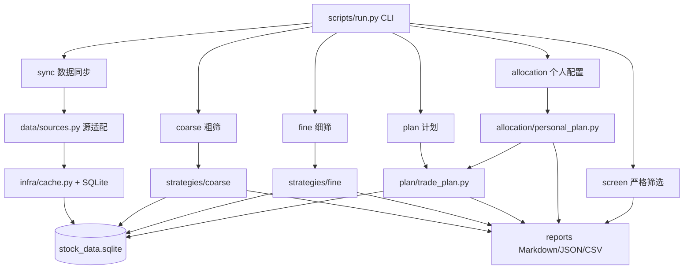

# Tech Growth Stock Screener

一个面向 A 股科技股的分层选股与交易计划研究工具。项目会从公开数据源获取股票、行业、财报和日线行情，缓存到 SQLite，再通过股票池、宏观粗筛、技术分析和计划层输出候选股票、技术评分和下一交易日规则化操作计划。

本项目用于研究和辅助决策，不构成投资建议，也不保证收益。

## 功能概览

- 股票池构建：按基础 universe 和行业/板块关键词筛选 A 股股票，并按 `board_name` 标注科技股、周期股等股票类型。
- 粗筛策略：基于市值、估值、成长、盈利、研发、成交额、价格强度、回撤等指标，每个策略默认保留 5 支股票。
- 组合评分：聚合成长、质量、风控、流动性和市场确认策略，输出潜力股研究清单。
- 技术分析：读取日线行情，计算 MA、MACD、RSI、成交额放大、突破、回撤、ATR 等技术指标，并输出技术评分。
- 计划层：根据细筛结果生成下一交易日规则计划，包括突破价、回踩区间、放量阈值、计划入场价、初始止损、止盈、移动止损和仓位上限。
- 个人配置计划：在计划层基础上叠加账户资金约束，输出 ETF 核心仓、个股卫星仓、现金预留和一手成本检查。
- SQLite 缓存：远程数据和日线行情会缓存到本地数据库，支持离线复用。
- 按需更新：筛选、细筛、计划和可视化命令可用 `--update-policy` 在运行前自动检查并增量更新必要数据。
- 多格式输出：支持 Markdown、JSON、CSV。
- 本地可视化：支持从 SQLite 生成指数成分股 HTML 报表。
- 数据质量诊断：输出缺失数据原因以及对评分和操作计划的影响。

## 架构图



## 分层说明

```text
scripts/
  run.py                 # 统一 CLI 入口
  common.py              # 通用配置、代理、字段处理
  infra/                 # 基建层：缓存、网络策略、预更新、日志
  data/                  # 兼容源适配层：AKShare/Sina/efinance/Eastmoney/CSV
  strategies/
    tech_growth.py       # 原始严格筛选策略
    coarse/              # 粗筛层：候选池 + 多策略评分
    fine/                # 细筛层：技术指标评分
  plan/
    trade_plan.py        # 下一交易日计划逻辑
    repository.py        # 计划层缓存读取
    network.py           # 计划层数据刷新 hook
  allocation/
    personal_plan.py     # 小资金账户的 ETF 核心仓 + 个股卫星仓配置
  reports/               # 展示层
references/              # 架构、schema、策略和计划规则文档
```

## 快速开始

### 1. 创建环境

```bash
cd /Users/xudoulei/work/tech-growth-stock-screener
python3 -m venv .venv
.venv/bin/python -m pip install pandas requests akshare efinance baostock rich openpyxl lxml html5lib beautifulsoup4 tabulate numpy
```

当前项目推荐使用 `/Users/xudoulei/work/tech-growth-stock-screener/.venv/bin/python` 运行命令。

### 2. 同步基础数据

```bash
python scripts/run.py sync --dataset spot
python scripts/run.py sync --dataset financials --report-date 20260331
```

同步日线行情：

```bash
python scripts/run.py sync --dataset daily_prices --codes 600584,000021 --start 2024-01-01 --end 2026-07-08
python scripts/run.py sync --dataset daily_prices --from-index --index-symbol 000300 --start 2026-01-09 --end 2026-07-09 --adjust qfq --source auto --no-proxy
python scripts/run.py sync --dataset daily_prices --from-index --index-symbol 000300 --start 2026-01-09 --end 2026-07-09 --adjust qfq --source auto --no-proxy --skip-existing
```

同步沪深 300 成分股：

```bash
python scripts/run.py sync --dataset index_constituents --index-symbol 000300
```

### 3. 按需更新后运行

旧行为默认保持不变：不加 `--update-policy` 时，命令仍按已有缓存和 `--source` 行为运行。

日常研究推荐：

```bash
python scripts/run.py combo --universe csi300 --top 20 --combo-strategy-top 20 --update-policy auto --format markdown
python scripts/run.py fine --universe csi300 --coarse-strategy all --coarse-top 5 --top 20 --update-policy auto --format markdown
python scripts/run.py plan --universe csi300 --coarse-strategy all --coarse-top 5 --top 5 --update-policy auto --format markdown
```

`--update-policy` 可选：

- `none`：默认值，不做预更新。
- `cache`：强制离线缓存模式，不联网。
- `auto`：检查所需数据，缺失或过期时增量同步；同步失败时继续用缓存并在 stderr 记录原因。
- `strict`：和 `auto` 类似，但必要数据更新失败会中止命令。
- `refresh`：强制刷新当前命令依赖的数据。

可用 `--update-start`、`--update-end` 控制日线更新区间；不指定时默认更新最近 180 天，`--update-end` 默认为当天。

### 4. 运行粗筛

```bash
python scripts/run.py coarse --strategy all --top 5 --format markdown
python scripts/run.py coarse --strategy all --top 5 --universe csi300 --source cache --format markdown
```

### 5. 运行细筛

```bash
python scripts/run.py fine --coarse-strategy all --coarse-top 5 --top 10 --format markdown
```

### 6. 运行潜力股组合评分

```bash
python scripts/run.py combo --top 20 --combo-strategy-top 20 --format markdown
python scripts/run.py combo --top 20 --combo-strategy-top 20 --universe csi300 --source cache --format markdown
```

### 7. 生成下一交易日计划

```bash
python scripts/run.py plan --coarse-strategy all --coarse-top 5 --top 5 --format markdown
```

### 8. 运行板块筛选

从指定基础股票池里按板块字段过滤，并最多保留 100 只股票：

```bash
python scripts/run.py sector-screen --universe csi300 --sector 半导体 --top 100 --source cache
python scripts/run.py sector-screen --universe tech --sector 通信设备 --top 100 --source cache
```

说明：

- `--universe csi300` 使用缓存的沪深 300 成分股。
- `--universe tech` 使用科技行业关键词池。
- `--sector` 当前按 `board_name` / 财报行业字段做包含匹配。
- “半导体”这类行业字段可以过滤；“光模块、先进封装”这类细分概念需要后续接入概念板块成分数据才可精确过滤。

### 9. 生成个人科技股配置计划

适合把 15000 元这类小资金账户落成“科技 ETF 核心仓 + 个股卫星仓 + 现金预留”的规则计划：

```bash
python scripts/run.py allocation --capital 15000 --source cache --format markdown
```

默认规则：

- 60% 科技 ETF 核心仓，分 3 笔买入。
- 20% 个股卫星仓。
- 20% 现金预留。
- 单只个股首次买入上限 12%，单只个股最大上限 20%。
- 对 A 股个股按 100 股一手估算成本；一手成本超过仓位上限的标的只作为风向标。

可调整参数：

```bash
python scripts/run.py allocation \
  --capital 15000 \
  --core-etf-pct 0.60 \
  --satellite-stock-pct 0.20 \
  --cash-pct 0.20 \
  --target-return 0.10 \
  --format markdown
```

### 10. 离线运行

如果已有缓存，可使用：

```bash
python scripts/run.py plan --coarse-strategy all --coarse-top 5 --top 5 --source cache
python scripts/run.py plan --coarse-strategy all --coarse-top 5 --top 5 --update-policy cache
python scripts/run.py sector-screen --universe csi300 --sector 半导体 --top 100 --source cache
python scripts/run.py allocation --capital 15000 --source cache
```

### 11. 生成交互式流程仪表盘

把一次运行中的股票池、宏观粗筛、技术分析和操作建议汇总到一个可交互 HTML。宏观粗筛最多保留 100 只，技术分析覆盖这些宏观粗筛股票，操作建议对技术分析结果中的所有股票生成下一交易日规则计划；矩阵中用点大小体现综合关注分，不额外给前 5 只加黑圈高亮，不合并个人预算或资金配置约束：

```bash
/Users/xudoulei/work/tech-growth-stock-screener/.venv/bin/python /Users/xudoulei/work/tech-growth-stock-screener/scripts/run.py dashboard --source cache
/Users/xudoulei/work/tech-growth-stock-screener/.venv/bin/python /Users/xudoulei/work/tech-growth-stock-screener/scripts/run.py dashboard --universe csi300 --sector 半导体 --source cache
```

默认输出：

```text
.cache/reports/dashboard_latest.html
```

也可以指定路径：

```bash
/Users/xudoulei/work/tech-growth-stock-screener/.venv/bin/python /Users/xudoulei/work/tech-growth-stock-screener/scripts/run.py dashboard --source cache --output /Users/xudoulei/work/tech-growth-stock-screener/.cache/reports/dashboard_latest.html
```

### 12. 验证仪表盘数据健康

在解读候选股前，先检查本次缓存数据是否足够可信：

```bash
/Users/xudoulei/work/tech-growth-stock-screener/.venv/bin/python /Users/xudoulei/work/tech-growth-stock-screener/scripts/run.py validate-dashboard --source cache
/Users/xudoulei/work/tech-growth-stock-screener/.venv/bin/python /Users/xudoulei/work/tech-growth-stock-screener/scripts/run.py validate-dashboard --source cache --expected-latest-trade-date 2026-07-10
```

输出会包含数据健康度、最新行情日、股票池行情指标缺失数、操作建议缺日线数、可执行计划数和阶段串行关系。仪表盘 HTML 顶部也会展示同一套健康摘要。

仪表盘支持：

- 阶段行数和最终动作分布。
- 顶部数据健康条，快速提示行情新鲜度、缺失覆盖和阶段串行关系。
- `宏观潜力 × 技术时机` 矩阵作为首页主视图，用宏观粗筛分判断潜力，用技术细筛分判断时机。
- 点击矩阵中的股票点，会在右侧股票介绍区域展示单股的潜力/时机解释；矩阵同时展示宏观粗筛和技术分析股票，综合关注分越高点越大。矩阵分割线与颜色规则一致：宏观潜力 80 以上为高潜力，技术时机 75 以上为好时机。
- 股票池表格展示股票类型，鼠标悬停可查看识别依据。
- 标签页查看各阶段结果。
- 全局搜索股票代码、名称、行业和动作。
- 表头点击排序。
- 点击股票行查看该股票在各阶段的轨迹。

### 13. 生成本地可视化报表

```bash
python scripts/run.py visualize --dataset index_constituents --index-symbol 000300
python scripts/run.py visualize --dataset coarse --strategy all --top 5 --source cache
python scripts/run.py visualize --dataset combo --top 20 --combo-strategy-top 20 --source cache
python scripts/run.py visualize --dataset coarse --strategy all --top 5 --universe csi300 --source cache --output .cache/reports/coarse_csi300.html
python scripts/run.py visualize --dataset combo --top 20 --combo-strategy-top 20 --universe csi300 --source cache --output .cache/reports/combo_csi300.html
python scripts/run.py visualize --dataset fine --coarse-strategy all --coarse-top 5 --top 20 --universe csi300 --source cache --output .cache/reports/fine_csi300.html
```

默认输出到：

```text
.cache/reports/index_constituents_000300.html
.cache/reports/coarse_all.html
.cache/reports/combo.html
.cache/reports/coarse_csi300.html
.cache/reports/combo_csi300.html
.cache/reports/fine_csi300.html
.cache/reports/dashboard_latest.html
```

## 数据缓存

默认数据库：

```text
$SKILL/.cache/stock_data.sqlite
```

可通过环境变量指定：

```bash
export TECH_GROWTH_DB=/path/to/stock_data.sqlite
export TECH_GROWTH_SCREENER_CACHE=/path/to/cache
```

核心表包括：

- `cache_meta`：逻辑数据源与 raw 表映射。
- `source_runs`：同步任务记录。
- `stocks`：股票基础信息。
- `market_cap_snapshot`：市值快照。
- `financial_reports`：财报字段。
- `industry_members`：行业/板块成分。
- `index_constituents`：指数成分股池，例如沪深 300 成分和权重。
- `quotes_daily`：日线 OHLCV。
- `layer_runs`：每次 screen、coarse、combo、fine、plan 运行的参数、元信息和行数。
- `layer_results`：每次层输出的完整逐行 JSON 快照，并冗余 code、name、rank、score、action 等常用查询字段。

预更新依赖：

- 粗筛和组合评分需要 spot、财报业绩和候选池；沪深 300 池还需要 `index_constituents`。
- 组合评分、细筛和计划会使用 `quotes_daily`；`--universe csi300 --update-policy auto` 会按沪深 300 成分股做最近 180 天的断点续跑。
- 科技关键词池仍使用行业板块缓存；自动日线补齐目前主要面向已缓存的沪深 300 指数池。

策略层结果默认会落库。若只想临时查看输出、不保存本次结果，可加 `--no-persist-results`。

## 网络和代理

默认情况下，程序会尝试使用环境变量或系统代理。若数据源直连更稳定，可加：

```bash
python scripts/run.py coarse --strategy all --no-proxy
```

也可以显式指定代理：

```bash
python scripts/run.py coarse --strategy all --proxy http://127.0.0.1:7890
```

如果上游数据源失败，建议先尝试：

- `--source cache`：只使用已有缓存。
- `--no-proxy`：绕过系统代理。
- `--refresh`：强制重新拉取。

## 输出说明

粗筛输出关注：

- 股票代码、名称、板块
- 市值、PE、PB、营收同比、利润同比
- 粗筛策略、粗筛评分、字段缺失说明

细筛输出关注：

- 技术评分
- MA、MACD、RSI、成交额放大、20 日收益、回撤
- `趋势强`、`放量突破`、`回撤可控` 等原因标签

计划输出关注：

- 动作：条件买入、等待回踩、等待放量确认、观察、暂不交易
- 突破触发价、回踩区间、放量确认成交额
- 计划入场价、初始止损、1R/2R 止盈
- 移动止损规则、仓位上限
- 数据缺失原因和影响

## 维护文档

更详细的设计和维护说明见：

- [项目架构](references/architecture.md)
- [数据缓存 schema](references/data-schema.md)
- [粗筛策略](references/coarse-strategies.md)
- [细筛策略](references/fine-strategies.md)
- [计划层规则](references/trade-plan-rules.md)
- [筛选规则](references/screening-rules.md)

## 开源前建议

发布前建议补充：

- `LICENSE`
- 依赖锁定文件，例如 `requirements.txt`
- 示例缓存或 mock 数据
- CI 校验，例如运行 `python -m compileall scripts`
- 数据源可用性说明

## 免责声明

本项目仅用于公开数据研究、策略实验和工程学习。输出内容不构成投资建议。股票市场存在风险，任何交易决策都应结合个人风险承受能力、资金管理和独立判断。
