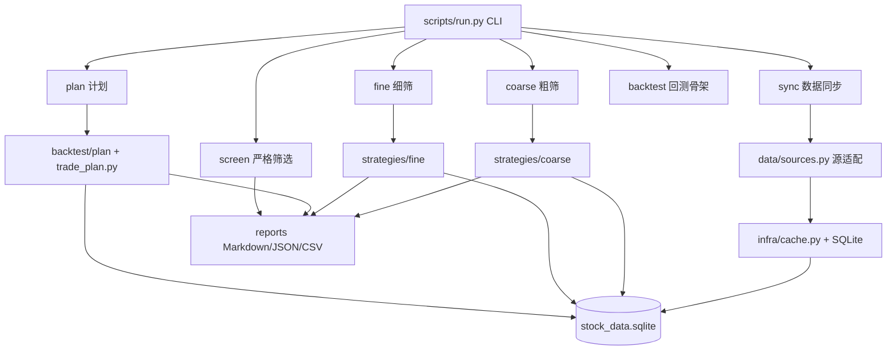

# Tech Growth Stock Screener

一个面向 A 股科技股的分层选股与交易计划研究工具。项目会从公开数据源获取股票、行业、财报和日线行情，缓存到 SQLite，再通过粗筛、细筛和计划层输出候选股票、技术评分和下一交易日规则化操作计划。

本项目用于研究和辅助决策，不构成投资建议，也不保证收益。

## 功能概览

- 科技股候选池构建：按科技行业/板块关键词筛选 A 股科技方向股票。
- 粗筛策略：基于市值、估值、成长、盈利、研发、成交额、价格强度、回撤等指标，每个策略默认保留 5 支股票。
- 细筛策略：读取日线行情，计算 MA、MACD、RSI、成交额放大、突破、回撤、ATR 等技术指标，并输出技术评分。
- 计划层：根据细筛结果生成下一交易日规则计划，包括突破价、回踩区间、放量阈值、计划入场价、初始止损、止盈、移动止损和仓位上限。
- SQLite 缓存：远程数据和日线行情会缓存到本地数据库，支持离线复用。
- 多格式输出：支持 Markdown、JSON、CSV。
- 数据质量诊断：输出缺失数据原因以及对评分和操作计划的影响。

## 架构图



## 分层说明

```text
scripts/
  run.py                 # 统一 CLI 入口
  common.py              # 通用配置、代理、字段处理
  infra/                 # 基建层：缓存、网络策略、日志
  data/                  # 兼容源适配层：AKShare/Sina/efinance/Eastmoney/CSV
  strategies/
    tech_growth.py       # 原始严格筛选策略
    coarse/              # 粗筛层：候选池 + 多策略评分
    fine/                # 细筛层：技术指标评分
  backtest/
    engine.py            # 等权回测骨架
    trade_plan.py        # 下一交易日计划逻辑
    plan/                # 计划层 repository/network 边界
  reports/               # 展示层
references/              # 架构、schema、策略和计划规则文档
```

## 快速开始

### 1. 创建环境

```bash
python -m venv venv
source venv/bin/activate
pip install pandas requests akshare efinance
```

如需更完整运行环境，可根据实际报错补充安装 `numpy`、`rich` 等依赖。

### 2. 同步基础数据

```bash
python scripts/run.py sync --dataset spot
python scripts/run.py sync --dataset financials --report-date 20260331
```

同步日线行情：

```bash
python scripts/run.py sync --dataset daily_prices --codes 600584,000021 --start 2024-01-01 --end 2026-07-08
```

### 3. 运行粗筛

```bash
python scripts/run.py coarse --strategy all --top 5 --format markdown
```

### 4. 运行细筛

```bash
python scripts/run.py fine --coarse-strategy all --coarse-top 5 --top 10 --format markdown
```

### 5. 生成下一交易日计划

```bash
python scripts/run.py plan --coarse-strategy all --coarse-top 5 --top 5 --format markdown
```

### 6. 离线运行

如果已有缓存，可使用：

```bash
python scripts/run.py plan --coarse-strategy all --coarse-top 5 --top 5 --source cache
```

## 数据缓存

默认数据库：

```text
$SKILL/.cache/stock_data.sqlite
```

可通过环境变量指定：

```bash
export TECH_GROWTH_DB=/path/to/stock_data.sqlite
export TECH_GROWTH_SCREENER_CACHE=/path/to/cache
```

核心表包括：

- `cache_meta`：逻辑数据源与 raw 表映射。
- `source_runs`：同步任务记录。
- `stocks`：股票基础信息。
- `market_cap_snapshot`：市值快照。
- `financial_reports`：财报字段。
- `industry_members`：行业/板块成分。
- `quotes_daily`：日线 OHLCV。

## 网络和代理

默认情况下，程序会尝试使用环境变量或系统代理。若数据源直连更稳定，可加：

```bash
python scripts/run.py coarse --strategy all --no-proxy
```

也可以显式指定代理：

```bash
python scripts/run.py coarse --strategy all --proxy http://127.0.0.1:7890
```

如果上游数据源失败，建议先尝试：

- `--source cache`：只使用已有缓存。
- `--no-proxy`：绕过系统代理。
- `--refresh`：强制重新拉取。

## 输出说明

粗筛输出关注：

- 股票代码、名称、板块
- 市值、PE、PB、营收同比、利润同比
- 粗筛策略、粗筛评分、字段缺失说明

细筛输出关注：

- 技术评分
- MA、MACD、RSI、成交额放大、20 日收益、回撤
- `趋势强`、`放量突破`、`回撤可控` 等原因标签

计划输出关注：

- 动作：条件买入、等待回踩、等待放量确认、观察、暂不交易
- 突破触发价、回踩区间、放量确认成交额
- 计划入场价、初始止损、1R/2R 止盈
- 移动止损规则、仓位上限
- 数据缺失原因和影响

## 维护文档

更详细的设计和维护说明见：

- [项目架构](references/architecture.md)
- [数据缓存 schema](references/data-schema.md)
- [粗筛策略](references/coarse-strategies.md)
- [细筛策略](references/fine-strategies.md)
- [计划层规则](references/trade-plan-rules.md)
- [回测规则](references/backtest-rules.md)
- [筛选规则](references/screening-rules.md)

## 开源前建议

发布前建议补充：

- `LICENSE`
- 依赖锁定文件，例如 `requirements.txt`
- 示例缓存或 mock 数据
- CI 校验，例如运行 `python -m compileall scripts`
- 数据源可用性说明

## 免责声明

本项目仅用于公开数据研究、策略实验和工程学习。输出内容不构成投资建议。股票市场存在风险，任何交易决策都应结合个人风险承受能力、资金管理和独立判断。

