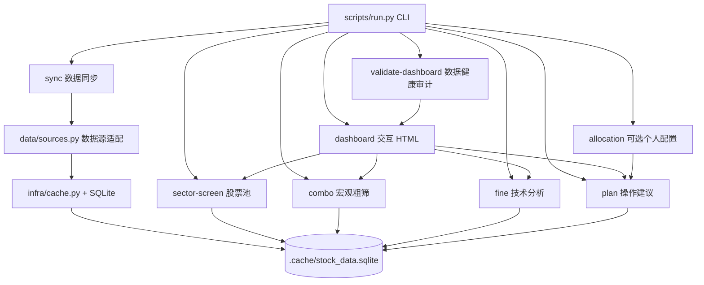

# Tech Growth Stock Screener

一个面向 A 股科技股的分层筛选与操作计划研究工具。项目会从公开第三方数据源获取股票、行业、财报和日线行情，缓存到 SQLite，再按串行流程输出候选股票、宏观评分、技术时机和下一交易日规则化操作建议。

本项目只用于公开数据研究、策略实验和辅助决策，不构成投资建议，也不保证收益。

## 当前主流程

```text
股票池 -> 宏观粗筛 -> 技术分析 -> 操作建议
```

关键约束：每个下游阶段只使用上一个阶段选出的股票，不从全市场重新取数。

当前 dashboard 默认数据规模：

- `股票池`：最多 100 只，按基础股票池和行业/板块条件形成研究 universe。
- `宏观粗筛`：最多 100 只，从股票池中按基本面、成长、质量、风控、流动性和动量综合排序。
- `技术分析`：覆盖全部宏观粗筛股票，计算趋势、动量、量能、突破、风险和流动性指标。
- `操作建议`：覆盖全部技术分析股票，生成下一交易日规则化计划；不包含个人预算、仓位预算或资金配置字段。

## 功能概览

- 股票池构建：支持 `tech` 科技关键词池和 `csi300` 沪深 300 缓存成分池，并可用 `--sector` 按行业/板块关键词过滤。
- 股票类型标注：股票池按 `configs/stock_type_rules.json` 配置规则识别科技股、周期股、金融股、消费/防御或自定义类型，dashboard hover 可查看命中关键词和识别依据。
- 股票类型过滤：`--stock-types` 可指定哪些类型进入宏观粗筛，股票池仍保留完整分类结果用于追溯。
- 宏观粗筛：聚合多策略共振、成长、质量、风控、流动性和动量，输出 `宏观粗筛分`。
- 技术分析：基于日线行情计算 MA、MACD、RSI、成交额放大、突破、回撤、ATR 等技术指标，输出 `技术分`。
- 操作建议：按规则生成 `观察`、`条件买入`、`等待回踩`、`等待放量确认`、`暂不交易` 等下一交易日计划字段。
- 潜力-时机矩阵：以宏观潜力为 x 轴、技术时机为 y 轴，点大小代表综合关注分，点击点位更新右侧股票介绍。
- 矩阵内检索：dashboard 支持按股票代码、名称、行业/板块、动作和原因快速检索当前矩阵内股票。
- 数据健康审计：`validate-dashboard` 和 dashboard 顶部健康条会提示行情新鲜度、缺失覆盖、可执行计划数和阶段串行关系。
- SQLite 缓存：远程数据与日线行情默认缓存到项目本地 `.cache/stock_data.sqlite`，支持离线复用。
- 多格式输出：主要 CLI 支持 Markdown、JSON、CSV；dashboard 输出静态 HTML。

## 架构图



## 目录结构

```text
scripts/
  run.py                 # 统一 CLI 入口
  common.py              # 通用配置、代理、字段处理、缓存路径
  infra/                 # 基建层：缓存、网络策略、预更新、日志
  data/                  # 数据源适配层：AKShare/Sina/efinance/Eastmoney/CSV
  dashboard/             # dashboard 串行流程、view model、健康审计
  strategies/
    tech_growth.py       # 原始严格筛选策略
    sector_screen.py     # 股票池筛选
    coarse/              # 宏观粗筛与组合评分
    fine/                # 技术指标评分
  plan/
    trade_plan.py        # 下一交易日规则计划
    repository.py        # 计划层缓存读取
    network.py           # 计划层数据刷新 hook
  allocation/
    personal_plan.py     # 可选个人资金配置，不进入 dashboard 主流程
  reports/               # Markdown/JSON/CSV/HTML 展示层
configs/                 # dashboard 股票类型规则配置
docs/                    # 当前项目上下文、数据规则、决策和交接文档
references/              # 架构、schema、策略和计划规则文档
tests/                   # 单元测试
```

## 快速开始

### 1. 创建项目本地环境

```bash
cd /Users/xudoulei/work/tech-growth-stock-screener
python3 -m venv .venv
.venv/bin/python -m pip install pandas requests akshare efinance baostock rich openpyxl lxml html5lib beautifulsoup4 tabulate numpy
```

后续命令推荐使用项目本地解释器：

```text
/Users/xudoulei/work/tech-growth-stock-screener/.venv/bin/python
```

### 2. 同步基础数据

```bash
/Users/xudoulei/work/tech-growth-stock-screener/.venv/bin/python /Users/xudoulei/work/tech-growth-stock-screener/scripts/run.py sync --dataset spot
/Users/xudoulei/work/tech-growth-stock-screener/.venv/bin/python /Users/xudoulei/work/tech-growth-stock-screener/scripts/run.py sync --dataset financials --report-date 20260331
/Users/xudoulei/work/tech-growth-stock-screener/.venv/bin/python /Users/xudoulei/work/tech-growth-stock-screener/scripts/run.py sync --dataset index_constituents --index-symbol 000300
```

同步指定股票日线行情：

```bash
/Users/xudoulei/work/tech-growth-stock-screener/.venv/bin/python /Users/xudoulei/work/tech-growth-stock-screener/scripts/run.py sync --dataset daily_prices --codes 600584,000021 --start 2024-01-01 --end 2026-07-10 --adjust qfq --source auto --no-proxy
```

按指数成分同步日线行情：

```bash
/Users/xudoulei/work/tech-growth-stock-screener/.venv/bin/python /Users/xudoulei/work/tech-growth-stock-screener/scripts/run.py sync --dataset daily_prices --from-index --index-symbol 000300 --start 2026-01-01 --end 2026-07-10 --adjust qfq --source auto --no-proxy --skip-existing
```

### 3. 生成交互式 dashboard

生成当前主视图：

```bash
/Users/xudoulei/work/tech-growth-stock-screener/.venv/bin/python /Users/xudoulei/work/tech-growth-stock-screener/scripts/run.py dashboard --source cache --output /Users/xudoulei/work/tech-growth-stock-screener/.cache/reports/dashboard_latest.html
```

按行业/板块过滤：

```bash
/Users/xudoulei/work/tech-growth-stock-screener/.venv/bin/python /Users/xudoulei/work/tech-growth-stock-screener/scripts/run.py dashboard --universe tech --sector 半导体 --source cache --output /Users/xudoulei/work/tech-growth-stock-screener/.cache/reports/dashboard_latest.html
```

使用沪深 300 作为基础池：

```bash
/Users/xudoulei/work/tech-growth-stock-screener/.venv/bin/python /Users/xudoulei/work/tech-growth-stock-screener/scripts/run.py dashboard --universe csi300 --source cache --output /Users/xudoulei/work/tech-growth-stock-screener/.cache/reports/dashboard_latest.html
```

只让指定股票类型进入宏观粗筛：

```bash
/Users/xudoulei/work/tech-growth-stock-screener/.venv/bin/python /Users/xudoulei/work/tech-growth-stock-screener/scripts/run.py dashboard --source cache --stock-types 科技股,周期股 --output /Users/xudoulei/work/tech-growth-stock-screener/.cache/reports/dashboard_latest.html
```

使用自定义股票类型规则：

```bash
/Users/xudoulei/work/tech-growth-stock-screener/.venv/bin/python /Users/xudoulei/work/tech-growth-stock-screener/scripts/run.py dashboard --source cache --stock-type-config /Users/xudoulei/work/tech-growth-stock-screener/configs/stock_type_rules.json
```

默认输出：

```text
.cache/reports/dashboard_latest.html
```

dashboard 支持：

- 顶部数据健康条，展示数据健康度、最新行情日、缺失覆盖和阶段串行关系。
- `宏观潜力 × 技术时机` 矩阵作为首页主视图。
- 矩阵点大小表示综合关注分：宏观潜力 * 65% + 技术时机 * 35%。
- 矩阵不再给前 5 名额外加黑圈，高优先级由点大小和右侧详情表达。
- 矩阵分割线与颜色阈值一致：宏观潜力 `>= 80` 为高潜力，技术时机 `>= 75` 为好时机。
- 矩阵搜索框可按代码、名称、板块、动作、原因和策略快速过滤股票。
- 矩阵股票类型 chips 可按当前矩阵内的股票类型快速过滤展示。
- 点击矩阵股票点后，右侧股票介绍会更新为该股票的宏观潜力、技术时机和操作建议说明。
- 完整阶段表格保留在页面下方，默认折叠/弱化展示，便于追溯明细。

### 4. 验证 dashboard 数据健康

```bash
/Users/xudoulei/work/tech-growth-stock-screener/.venv/bin/python /Users/xudoulei/work/tech-growth-stock-screener/scripts/run.py validate-dashboard --source cache
/Users/xudoulei/work/tech-growth-stock-screener/.venv/bin/python /Users/xudoulei/work/tech-growth-stock-screener/scripts/run.py validate-dashboard --source cache --expected-latest-trade-date 2026-07-10
```

输出会检查：

- 股票池、宏观粗筛、技术分析、操作建议的阶段行数。
- 下游股票是否都来自上游阶段。
- 股票池行情指标是否缺失。
- 操作建议是否缺少日线行情。
- 可执行计划数量。
- 最新行情日是否符合预期。
- 已知 0-100 分数字段是否越界。

### 5. 单独运行各阶段

股票池：

```bash
/Users/xudoulei/work/tech-growth-stock-screener/.venv/bin/python /Users/xudoulei/work/tech-growth-stock-screener/scripts/run.py sector-screen --universe tech --sector 半导体 --top 100 --source cache
/Users/xudoulei/work/tech-growth-stock-screener/.venv/bin/python /Users/xudoulei/work/tech-growth-stock-screener/scripts/run.py sector-screen --universe csi300 --sector 通信设备 --top 100 --source cache
```

宏观粗筛：

```bash
/Users/xudoulei/work/tech-growth-stock-screener/.venv/bin/python /Users/xudoulei/work/tech-growth-stock-screener/scripts/run.py combo --top 100 --combo-strategy-top 20 --source cache --format markdown
```

技术分析：

```bash
/Users/xudoulei/work/tech-growth-stock-screener/.venv/bin/python /Users/xudoulei/work/tech-growth-stock-screener/scripts/run.py fine --coarse-strategy all --coarse-top 100 --top 100 --source cache --format markdown
```

操作建议：

```bash
/Users/xudoulei/work/tech-growth-stock-screener/.venv/bin/python /Users/xudoulei/work/tech-growth-stock-screener/scripts/run.py plan --coarse-strategy all --coarse-top 100 --top 100 --source cache --format markdown
```

严格科技成长筛选：

```bash
/Users/xudoulei/work/tech-growth-stock-screener/.venv/bin/python /Users/xudoulei/work/tech-growth-stock-screener/scripts/run.py screen --top 30 --source cache --format markdown
```

### 6. 按需更新策略

不加 `--update-policy` 时，命令保持当前缓存/数据源行为。需要运行前自动补数据时可使用：

```bash
/Users/xudoulei/work/tech-growth-stock-screener/.venv/bin/python /Users/xudoulei/work/tech-growth-stock-screener/scripts/run.py dashboard --universe csi300 --update-policy auto --update-start 2026-01-01 --update-end 2026-07-10
```

`--update-policy` 可选：

- `none`：默认值，不做预更新。
- `cache`：强制离线缓存模式，不联网。
- `auto`：检查所需数据，缺失或过期时增量同步；同步失败时继续用缓存并在 stderr 记录原因。
- `strict`：和 `auto` 类似，但必要数据更新失败会中止命令。
- `refresh`：强制刷新当前命令依赖的数据。

常用更新参数：

- `--update-start`：日线预更新开始日期。
- `--update-end`：日线预更新结束日期，默认当天。
- `--update-daily-window-days`：未指定日期时的默认回看天数，默认 180 天。
- `--update-adjust`：日线复权模式，可选空值、`qfq`、`hfq`。

### 7. 离线运行

已有缓存时，优先用 `--source cache` 或 `--update-policy cache`：

```bash
/Users/xudoulei/work/tech-growth-stock-screener/.venv/bin/python /Users/xudoulei/work/tech-growth-stock-screener/scripts/run.py dashboard --source cache
/Users/xudoulei/work/tech-growth-stock-screener/.venv/bin/python /Users/xudoulei/work/tech-growth-stock-screener/scripts/run.py validate-dashboard --source cache
/Users/xudoulei/work/tech-growth-stock-screener/.venv/bin/python /Users/xudoulei/work/tech-growth-stock-screener/scripts/run.py plan --coarse-strategy all --coarse-top 100 --top 100 --source cache
```

### 8. 可选个人配置计划

`allocation` 仍保留为独立 CLI 工具，用于把规则计划叠加到账户资金约束；它不是当前 dashboard 主流程的一部分。

```bash
/Users/xudoulei/work/tech-growth-stock-screener/.venv/bin/python /Users/xudoulei/work/tech-growth-stock-screener/scripts/run.py allocation --capital 15000 --source cache --format markdown
```

默认配置逻辑：

- 60% 科技 ETF 核心仓，分 3 笔买入。
- 20% 个股卫星仓。
- 20% 现金预留。
- 单只个股首次买入上限 12%，单只个股最大上限 20%。
- 对 A 股个股按 100 股一手估算成本；一手成本超过仓位上限的标的只作为观察对象。

### 9. 生成本地可视化报表

```bash
/Users/xudoulei/work/tech-growth-stock-screener/.venv/bin/python /Users/xudoulei/work/tech-growth-stock-screener/scripts/run.py visualize --dataset index_constituents --index-symbol 000300
/Users/xudoulei/work/tech-growth-stock-screener/.venv/bin/python /Users/xudoulei/work/tech-growth-stock-screener/scripts/run.py visualize --dataset combo --top 100 --combo-strategy-top 20 --source cache --output /Users/xudoulei/work/tech-growth-stock-screener/.cache/reports/combo.html
/Users/xudoulei/work/tech-growth-stock-screener/.venv/bin/python /Users/xudoulei/work/tech-growth-stock-screener/scripts/run.py visualize --dataset fine --coarse-strategy all --coarse-top 100 --top 100 --source cache --output /Users/xudoulei/work/tech-growth-stock-screener/.cache/reports/fine.html
```

常见输出路径：

```text
.cache/reports/index_constituents_000300.html
.cache/reports/combo.html
.cache/reports/fine.html
.cache/reports/dashboard_latest.html
```

## 数据缓存

默认数据库：

```text
.cache/stock_data.sqlite
```

可通过环境变量指定：

```bash
export TECH_GROWTH_DB=/path/to/stock_data.sqlite
export TECH_GROWTH_SCREENER_CACHE=/path/to/cache
```

核心表包括：

- `cache_meta`：逻辑数据源与 raw 表映射。
- `source_runs`：同步任务记录。
- `stocks`：股票基础信息。
- `market_cap_snapshot`：市值快照。
- `financial_reports`：财报字段。
- `industry_members`：行业/板块成分。
- `index_constituents`：指数成分股池，例如沪深 300 成分和权重。
- `quotes_daily`：日线 OHLCV。
- `layer_runs`：每次 screen、coarse、combo、fine、plan 运行的参数、元信息和行数。
- `layer_results`：每次层输出的完整逐行 JSON 快照，并冗余 code、name、rank、score、action 等常用查询字段。

策略层结果默认会落库。若只想临时查看输出、不保存本次结果，可加 `--no-persist-results`。

## 分数和展示口径

宏观粗筛分：

```text
多策略共振分 * 35%
+ 成长分 * 20%
+ 质量分 * 18%
+ 风控分 * 15%
+ 流动性分 * 7%
+ 动量分 * 5%
```

技术分：

```text
趋势分 * 30
+ 动量分 * 20
+ 量能分 * 20
+ 突破分 * 15
+ 风险分 * 10
+ 流动性分 * 5
```

dashboard 展示规则：

- 金额通常以 `亿` 展示。
- 百分比字段展示为 `%`。
- 分数和常用数值通常保留两位小数。
- 操作建议只展示计划字段，不展示预算、资金配置或一手成本检查。
- 数据健康审计只做诊断，不改变筛选公式、排序或操作建议。

## 网络和代理

默认情况下，程序会尝试使用环境变量或 macOS 系统代理。若数据源直连更稳定，可加：

```bash
/Users/xudoulei/work/tech-growth-stock-screener/.venv/bin/python /Users/xudoulei/work/tech-growth-stock-screener/scripts/run.py dashboard --source auto --no-proxy
```

也可以显式指定代理：

```bash
/Users/xudoulei/work/tech-growth-stock-screener/.venv/bin/python /Users/xudoulei/work/tech-growth-stock-screener/scripts/run.py dashboard --source auto --proxy http://127.0.0.1:7890
```

如果上游数据源失败，建议按顺序尝试：

- `--source cache`：只使用已有缓存。
- `--no-proxy`：绕过系统代理。
- `--refresh` 或 `--update-policy refresh`：强制重新拉取。

## 验证和维护

运行测试：

```bash
/Users/xudoulei/work/tech-growth-stock-screener/.venv/bin/python -m unittest discover -s tests
```

生成 dashboard 并验证数据：

```bash
/Users/xudoulei/work/tech-growth-stock-screener/.venv/bin/python /Users/xudoulei/work/tech-growth-stock-screener/scripts/run.py dashboard --source cache --output /Users/xudoulei/work/tech-growth-stock-screener/.cache/reports/dashboard_latest.html
/Users/xudoulei/work/tech-growth-stock-screener/.venv/bin/python /Users/xudoulei/work/tech-growth-stock-screener/scripts/run.py validate-dashboard --source cache
```

检查格式：

```bash
git diff --check
```

更多维护说明：

- [当前项目上下文](docs/project-context.md)
- [数据规则](docs/data-rules.md)
- [长期决策记录](docs/decisions.md)
- [交接记录](docs/handoff.md)
- [项目架构](references/architecture.md)
- [数据缓存 schema](references/data-schema.md)
- [粗筛策略](references/coarse-strategies.md)
- [细筛策略](references/fine-strategies.md)
- [计划层规则](references/trade-plan-rules.md)
- [筛选规则](references/screening-rules.md)

## 开源前建议

发布前建议补充：

- `LICENSE`
- 依赖锁定文件，例如 `requirements.txt`
- 示例缓存或 mock 数据
- CI 校验，例如运行测试和 `git diff --check`
- 数据源可用性与延迟说明

## 免责声明

本项目仅用于公开数据研究、策略实验和工程学习。输出内容不构成投资建议。股票市场存在风险，任何交易决策都应结合个人风险承受能力、资金管理和独立判断。
