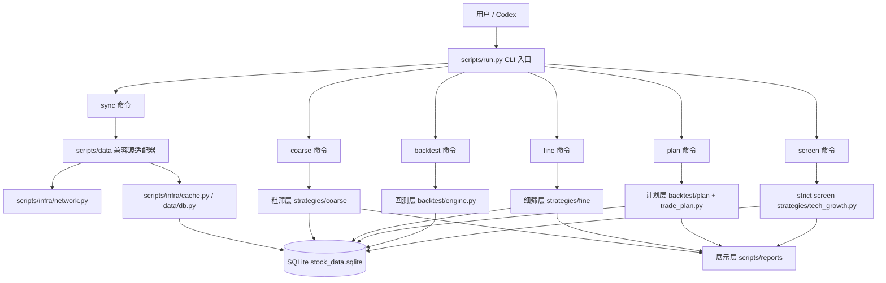
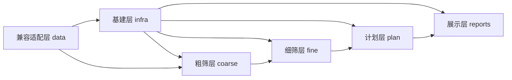
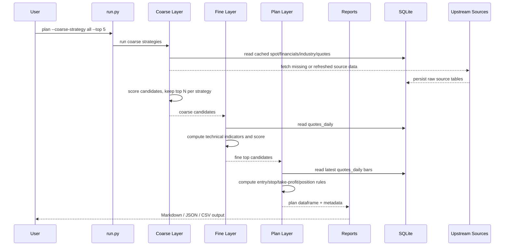
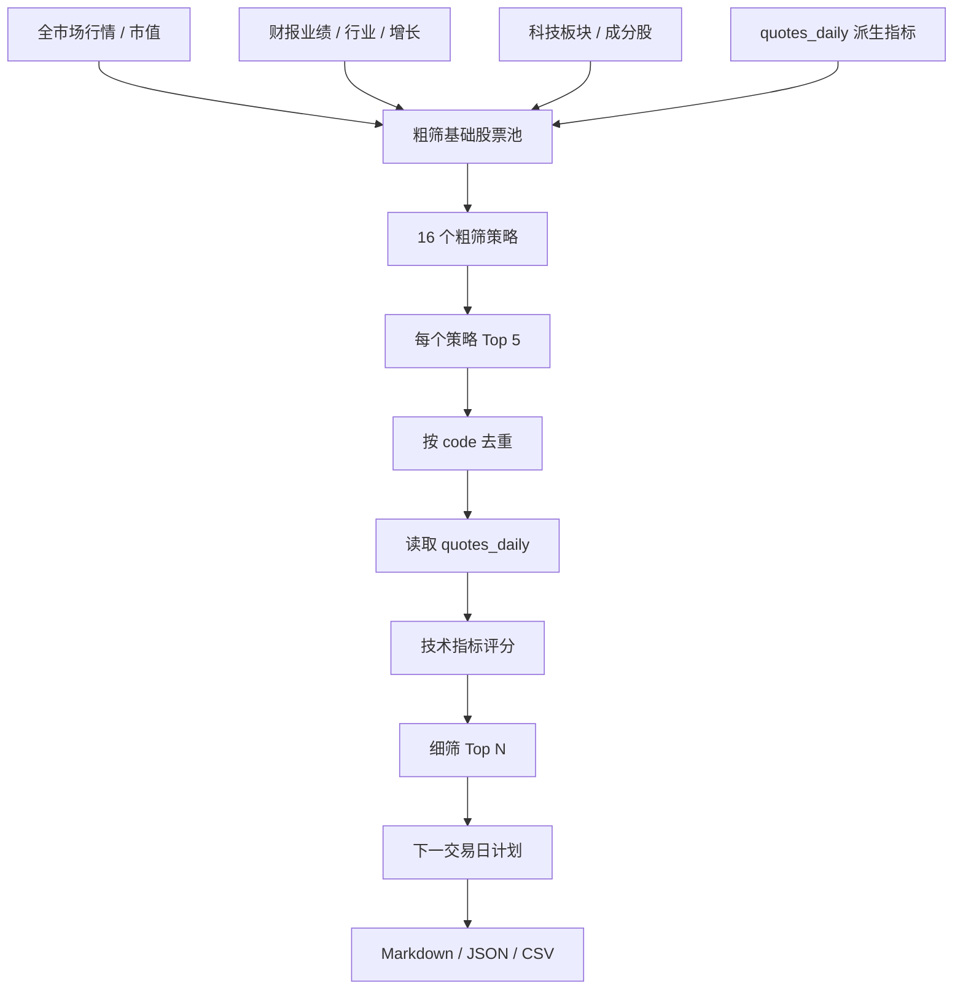

# Tech Growth Stock Screener Architecture

本文档用于帮助维护者快速理解 `tech-growth-stock-screener` 的代码结构、数据流、缓存边界和后续扩展方式。

## 1. 项目定位

`tech-growth-stock-screener` 是一个 A 股科技股筛选 skill。它的目标不是直接给出确定性买卖结论，而是把公开数据转化为一套可迭代的研究流程：

1. 从公开数据源获取股票、行业、财报、日线行情。
2. 将数据缓存到 SQLite。
3. 粗筛科技股候选。
4. 细筛技术面强弱。
5. 生成下一交易日的规则化操作计划。
6. 用 Markdown、JSON 或 CSV 展示结果。

核心原则：

- 外部数据必须缓存到数据库后再被策略使用。
- 策略层不直接调用远程数据源。
- 每一层尽量拆成 `network.py`、`repository.py`、逻辑模块。
- 输出必须保留数据缺失原因和评测影响。
- 结果是研究和规则计划，不是收益保证。

## 2. 总体架构图



## 3. 分层职责



### 3.1 基建层

位置：`scripts/infra/`

职责：

- 封装 SQLite 缓存读写入口。
- 封装通用网络降级辅助。
- 封装代理策略。
- 封装日志能力。

主要文件：

- `infra/cache.py`: 统一读取 `quotes_daily`、读取派生日线指标、复用底层 SQLite helper。
- `infra/network.py`: 暴露 `apply_network_policy`、`run_fetchers`、`source_chain`。
- `infra/logging.py`: 简单日志 helper。

### 3.2 兼容源适配层

位置：`scripts/data/`

这是历史遗留的数据适配层，目前保留为兼容入口。它仍然承担大量远程源拉取和标准化逻辑，但从架构上应视为“源适配器”，而不是业务数据层。

主要文件：

- `data/db.py`: SQLite schema、raw source table 写入、`quotes_daily` 写入。
- `data/sources.py`: AKShare、Sina、efinance、Eastmoney direct、CSV cache 的兼容适配。

后续演进方向：

- 通用缓存能力逐步沉到 `infra/cache.py`。
- 业务层专属数据组装放在各层 `repository.py`。
- 新增数据源时仍可先放在 `data/sources.py`，但必须保证写入 SQLite 后再被策略消费。

### 3.3 粗筛层

位置：`scripts/strategies/coarse/`

职责：

- 构建科技股候选池。
- 合并市值、财报、估值、行业、日线派生指标。
- 按 16 个粗筛策略打分。
- 每个策略默认保留 5 支股票。

主要文件：

- `coarse/network.py`: 拉取粗筛需要的源数据包。
- `coarse/repository.py`: 组装粗筛基础股票池。
- `coarse/registry.py`: 策略注册、评分函数、排序和输出字段。

粗筛不是从数据源直接拉“排名靠前股票”。它先构建科技板块全量候选，再在本地按策略评分排序。

### 3.4 细筛层

位置：`scripts/strategies/fine/`

职责：

- 接收粗筛结果。
- 按股票代码去重。
- 读取 `quotes_daily` 历史日线。
- 计算技术指标和技术评分。
- 输出评分、原因标签和数据质量说明。

主要文件：

- `fine/network.py`: 日线刷新 hook。
- `fine/repository.py`: 加载粗筛候选和缓存日线。
- `fine/technical.py`: 技术指标、评分权重、原因标签。

细筛层目前不保存历史评分结果；历史数据主要来自 `quotes_daily`。

### 3.5 计划层

位置：`scripts/backtest/plan/` 和 `scripts/backtest/trade_plan.py`

职责：

- 接收细筛前 5 支股票。
- 读取缓存日线。
- 根据技术评分和原因标签生成下一交易日计划。
- 输出入场价、突破价、回踩区间、放量阈值、止损、止盈、移动止损、仓位上限和数据诊断。

主要文件：

- `backtest/plan/network.py`: 计划层数据刷新 hook。
- `backtest/plan/repository.py`: 加载缓存日线。
- `backtest/trade_plan.py`: 操作计划核心规则。

计划层不重新选股，也不直接拉远程数据。

### 3.6 展示层

位置：`scripts/reports/`

职责：

- 将 screen、coarse、fine、plan 的结果渲染成 Markdown。
- JSON 和 CSV 输出由 `run.py` 统一处理。
- 展示层不拉远程数据，不改变策略结果。

主要文件：

- `reports/markdown.py`: strict screen Markdown。
- `reports/coarse_markdown.py`: 粗筛 Markdown。
- `reports/fine_markdown.py`: 细筛 Markdown。
- `reports/trade_plan_markdown.py`: 计划 Markdown。
- `reports/repository.py`: 展示层数据辅助。
- `reports/network.py`: 保留展示层边界；展示层不做网络访问。

## 4. 数据流



## 5. 命令入口

统一入口：`scripts/run.py`

支持命令：

- `sync`: 同步数据到 SQLite。
- `screen`: 运行原始 strict tech-growth 策略。
- `coarse`: 运行粗筛策略。
- `fine`: 运行粗筛后的技术细筛。
- `plan`: 运行细筛后的下一交易日计划。
- `backtest`: 运行当前等权回测骨架。

常用命令：

```bash
python scripts/run.py coarse --strategy all --top 5
python scripts/run.py fine --coarse-strategy all --coarse-top 5 --top 10
python scripts/run.py plan --coarse-strategy all --coarse-top 5 --top 5
python scripts/run.py sync --dataset daily_prices --codes 600584,000021 --start 2024-01-01 --end 2026-07-08
```

离线缓存运行：

```bash
python scripts/run.py plan --coarse-strategy all --coarse-top 5 --top 5 --source cache
```

## 6. 数据库和缓存

默认数据库：

```text
$SKILL/.cache/stock_data.sqlite
```

可通过环境变量覆盖：

```text
TECH_GROWTH_DB=/path/to/stock_data.sqlite
TECH_GROWTH_SCREENER_CACHE=/path/to/cache
```

核心表：

- `cache_meta`: 记录 logical source key 和 raw SQLite table 的映射。
- `source_runs`: 记录同步任务和错误。
- `stocks`: 标准化股票身份信息。
- `market_cap_snapshot`: 市值快照。
- `financial_reports`: 标准化财报字段。
- `industry_members`: 行业或板块成分。
- `quotes_daily`: 日线 OHLCV，供细筛、计划、回测使用。

缓存策略：

- 财报数据按报告期保留。
- `quotes_daily` 按 `code + trade_date + source` 保留历史。
- spot、行业板块、板块成分股 raw table 偏当前快照。
- 粗筛、细筛、计划结果当前不单独沉淀历史运行结果。

建议后续新增：

- `coarse_runs`, `coarse_results`
- `fine_runs`, `fine_results`
- `plan_runs`, `plan_results`

## 7. 策略数据流图



## 8. 目录结构

```text
tech-growth-stock-screener/
  SKILL.md
  agents/
    openai.yaml
  references/
    architecture.md
    data-schema.md
    coarse-strategies.md
    fine-strategies.md
    trade-plan-rules.md
    screening-rules.md
    backtest-rules.md
  scripts/
    run.py
    screen.py
    common.py
    infra/
      cache.py
      network.py
      logging.py
    data/
      db.py
      sources.py
    strategies/
      tech_growth.py
      coarse/
        network.py
        repository.py
        registry.py
      fine/
        network.py
        repository.py
        technical.py
    backtest/
      engine.py
      trade_plan.py
      plan/
        network.py
        repository.py
    reports/
      markdown.py
      coarse_markdown.py
      fine_markdown.py
      trade_plan_markdown.py
      repository.py
      network.py
```

## 9. 扩展指南

### 9.1 新增数据源

优先位置：

- 通用源适配：`scripts/data/sources.py`
- 通用网络能力：`scripts/infra/network.py`
- 通用缓存能力：`scripts/infra/cache.py`

要求：

1. 远程数据先写 SQLite raw source table。
2. 标准化数据再写核心表，如 `quotes_daily`。
3. 策略层只读 repository/cache 输出。
4. 文档同步更新 `references/data-schema.md`。

### 9.2 新增粗筛策略

修改：

- `scripts/strategies/coarse/registry.py`
- 必要时 `scripts/strategies/coarse/repository.py`
- `references/coarse-strategies.md`

步骤：

1. 添加 score function。
2. 注册到 `STRATEGIES`。
3. 声明 `required_metrics` 和 `positive_filters`。
4. 验证单策略和 `--strategy all`。

### 9.3 新增细筛指标

修改：

- `scripts/strategies/fine/technical.py`
- 必要时 `scripts/strategies/fine/repository.py`
- `references/fine-strategies.md`

步骤：

1. 添加指标计算。
2. 决定是否进入 `OUTPUT_COLUMNS`。
3. 调整 component score 或 reason label。
4. 保留缺失数据降级说明。

### 9.4 新增计划规则

修改：

- `scripts/backtest/trade_plan.py`
- `scripts/reports/trade_plan_markdown.py`
- `references/trade-plan-rules.md`

步骤：

1. 保持动作选择依赖细筛评分和标签。
2. 所有价位规则从缓存日线计算。
3. 新字段加入 `OUTPUT_COLUMNS`。
4. 展示层同步渲染。
5. 明确数据缺失时的影响。

### 9.5 新增展示格式

修改：

- `scripts/run.py`
- `scripts/reports/`

注意：

- 展示层只渲染结果，不改变结果。
- 不在展示层补拉数据。
- 新格式应保留数据质量和缺失影响说明。

## 10. 维护约束

- 不要让策略直接访问 AKShare、Sina、Eastmoney、efinance。
- 不要让展示层改变排序、评分或交易规则。
- 不要把缺失数据静默忽略。
- 不要把粗筛结果当作买入清单。
- 不要把计划层输出写成保证成交或保证收益。
- 改 schema 时同步 `data-schema.md`。
- 改粗筛逻辑时同步 `coarse-strategies.md`。
- 改细筛逻辑时同步 `fine-strategies.md`。
- 改计划逻辑时同步 `trade-plan-rules.md`。

## 11. 当前已知演进方向

建议后续分阶段完善：

1. 将 `scripts/data/` 中的通用缓存和网络能力继续下沉到 `scripts/infra/`。
2. 增加粗筛、细筛、计划的历史运行表。
3. 为细筛评分增加回测反馈，验证权重有效性。
4. 为计划层增加组合级仓位控制。
5. 增加数据源健康检查和 source quality score。
6. 增加更完整的离线测试样本。

